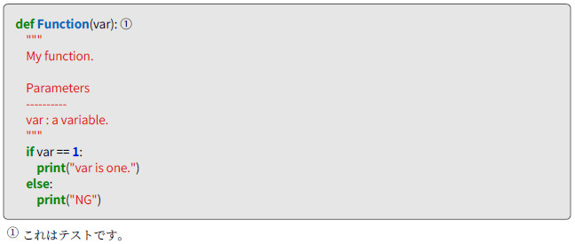
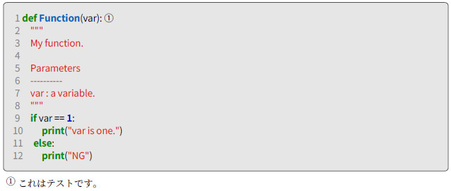
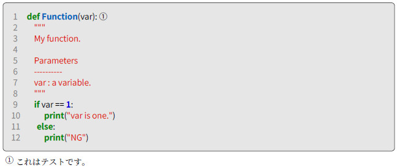
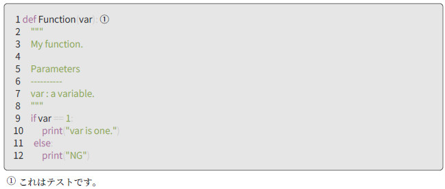
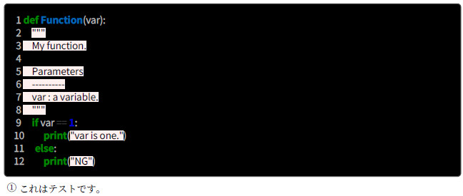
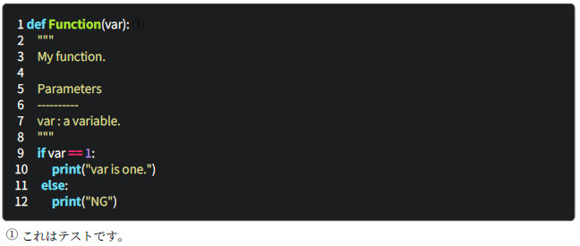
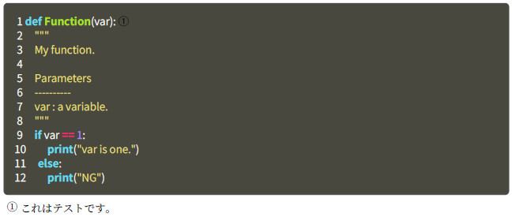
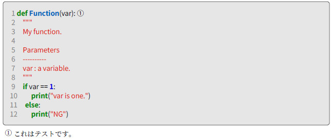

//==========
// 属性(Attribute)
//==========

// 文書の情報
// * :version-label: を値無しにすることで好みの記述にできます。
:lang: ja
:doctype: book
:author: WAKU-TAKE-A
:revdate: 2019年3月11日
:revnumber: 1.2版
:version-label:
// ディレクトリやテーマファイルなどの設定
:pdf-style: my-theme.yml
:imagesdir: ./img
//:pdf-fontsdir: ../fonts
// シンタックスハイライトの設定
// ・Rougeを使います。asciidoctorインストールが必要です
// ・rougeのスタイルは、https://github.com/jneen/rouge/tree/master/lib/rouge/themes にあります
// ・デフォルトはgithubです
:source-highlighter: rouge
:rouge-style: pastie  

//===========
// 本文(Body)
//===========

= Rougeによるシンタックスハイライト

AsciiDoctorにおけるハイライト用ツールは、CodeRay・Pygments・Rougeなどがあります。今回は、Rougeを利用します。

== 利用手順

`Gemfile` に、 

----
gem "asciidoctor-rouge"
----

を追記し、
 
----
bundle install
----

してください。

後は、adocファイルに以下のような属性を追記します。

----
:source-highlighter: rouge
:rouge-style: pastie //<1>
----

<1> 見え方を変更できます。

== サンプルコード

以下のようなコードで試してみます。

image::test_001.jpg[]

対応している言語については、 http://rouge.jneen.net/[こちら] を参考にしてください。

== 行番号の有り、無し

----
[source, python]
----

の場合、

----
[source, python, linenums]
----

の場合、

image::rouge_linenums_002.jpg[]

== indentについて

----
[source, python, linenums, indent=0]
----

の場合、

----
[source, python, linenums, indent=4]
----

の場合、

== rouge-styleによる見え方

rouge-styleによりどのように変わるか試してみました。個人的には、pastieが好みです。

* base16 + 

* colorful + 

<<<

* github + 
image:rouge_github.jpg[]

* gruvbox + 
image:rouge_gruvbox.jpg[]

* igor_pro + 
image:rouge_igor_pro.jpg[]

<<<

* molokai + 

* monokai + 

* monokai_sublime + 
image:rouge_monokai_sublime.jpg[]

<<<

* pastie + 

* thankful_eyes + 
image:rouge_thankful_eyes.jpg[]

== 本ページについて

本ページはAsciiDocで作成しています。 https://github.com/WAKU-TAKE-A/asciidoctor_sample004[こちら] にサンプルを置いておきます。サンプルは、「 https://waku-take-a.github.io/Visual%2520Studio%2520Code%25E3%2581%258B%25E3%2582%2589PDF%25E3%2582%2592%25E5%2587%25BA%25E5%258A%259B%25E3%2581%2599%25E3%2582%258B.html[Visual Studio CodeからPDFを出力する] 」の方法で比較的簡単にPDFやHTMLにすることができます。

AsciiDoc_Sample終わり