//==========
// Attribute
//==========

// 文書の情報
// * :version-label: を値無しにすることで好みの記述にできます。
:lang: ja
:doctype: book
:author: WAKU-TAKE-A
:revdate: 2019年3月11日
:revnumber: 1.0版
:version-label:
// テーマファイルの設定
:pdf-style: my-theme.yml
// シンタックスハイライトの設定
// ・Rougeを使います。asciidoctorインストールが必要です
// ・rougeのスタイルは、https://github.com/jneen/rouge/tree/master/lib/rouge/themes にあります
// ・デフォルトはgithubです
:source-highlighter: rouge
:rouge-style: pastie  

//===========
// Body
//===========

= Rougeによるシンタックスハイライト

AsciiDoctorにおけるハイライト用ツールは、CodeRay・Pygments・Rougeなどがあります。今回は、Rougeを利用します。

== 利用手順

`Gemfile` に、 

----
gem "asciidoctor-rouge"
----

を追記し、
 
----
bundle install
----

してください。

後は、adocファイルに以下のような属性を追記します。

----
:source-highlighter: rouge
:rouge-style: pastie //<1>
----

<1> 見え方を変更できます。

== サンプルコード

以下のようなコードで試してみます。

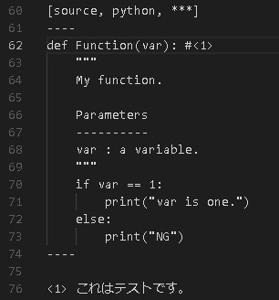

== 行番号の有り、無し

----
[source, python]
----

の場合、

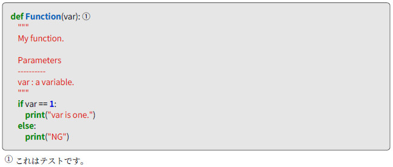

----
[source, python, linenums]
----

の場合、

== indentについて

----
[source, python, linenums, indent=0]
----

の場合、

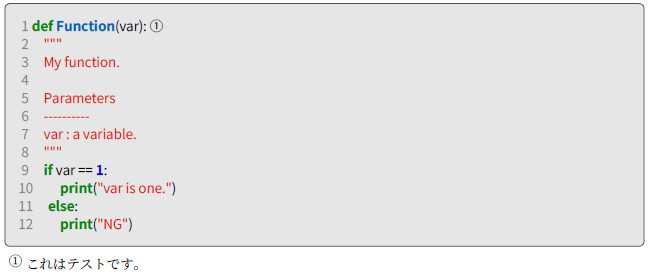

----
[source, python, linenums, indent=4]
----

の場合、

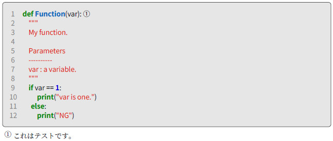

== rouge-styleによる見え方

rouge-styleによりどのように変わるか試してみました。個人的には、pastieが好みです。

* base16 + 
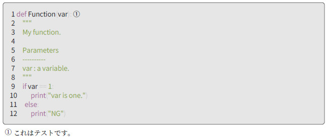

* colorful + 
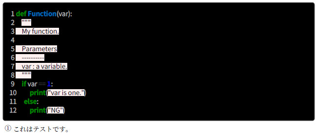

<<<

* github + 
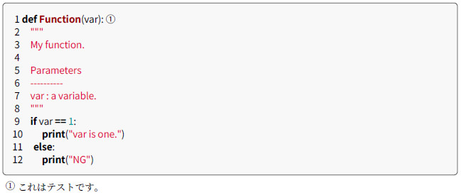

* gruvbox + 
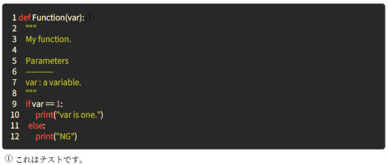

* igor_pro + 
image:rouge_igor_pro.jpg[]

<<<

* molokai + 
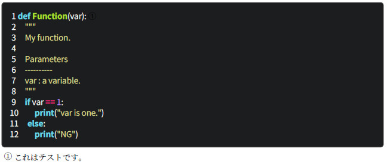

* monokai + 
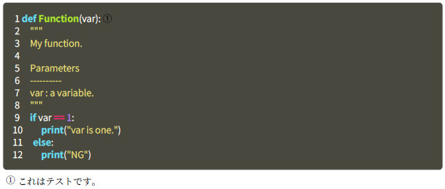

* monokai_sublime + 
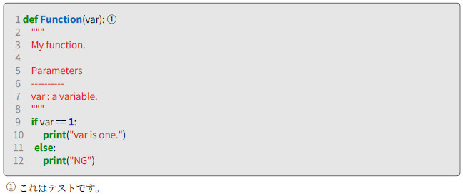

<<<

* pastie + 
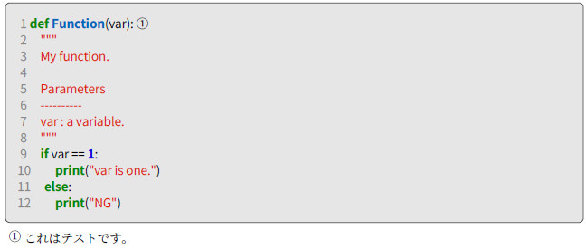

* thankful_eyes + 
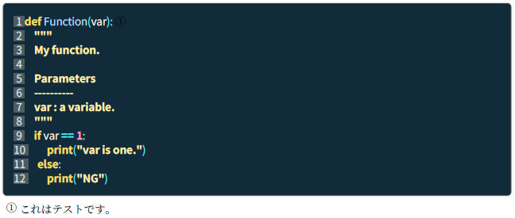

